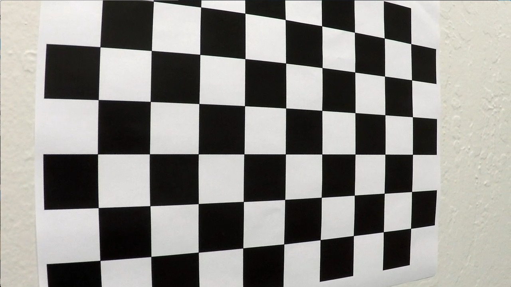
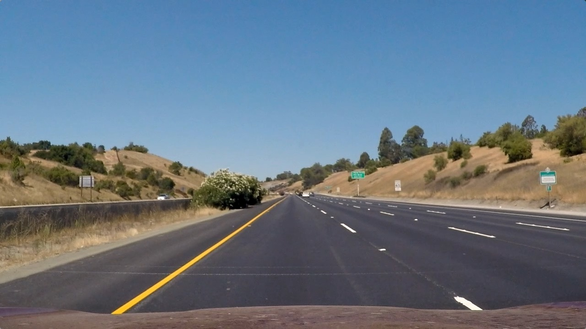

## **Advanced Lane Finding**

Detect lane lines on the road in real time, estimate it curvature and vehicle position in respect to lane center.

---

**Advanced Lane Finding Project**

The goals / steps of this project are the following:

* Compute the camera calibration matrix and distortion coefficients given a set of chessboard images.
* Apply a distortion correction to raw images.
* Use color transforms, gradients, etc., to create a thresholded binary image.
* Apply a perspective transform to rectify binary image ("birds-eye view").
* Detect lane pixels and fit to find the lane boundary.
* Determine the curvature of the lane and vehicle position with respect to center.
* Warp the detected lane boundaries back onto the original image.
* Output visual display of the lane boundaries and numerical estimation of lane curvature and vehicle position.

## Rubric Points
Here I will consider the [rubric points](https://review.udacity.com/#!/rubrics/571/view) individually and describe how I addressed each point in my implementation.  

---

### Writeup / README

#### 1. Provide a Writeup.

This is a writeup of my project implementation.

### Camera Calibration

#### 1. Briefly state how you computed the camera matrix and distortion coefficients.

In my code camera calibration is implemented in method `CameraManager.calibrateOnChessboard()`. This method use calibration by chessboard method. I used OpenCV method `cv2.findChessboardCorners()` to detect corners of chessboard. After that I mapped it to (x, y, z) coordinate system with assumption that z = 0 (plane image) and chessboard corners have integer coordinates 0,1,2... Initially I tried to recognize automatically whole set of test images. But finally approach was changed.

After several attempts calibrate camera on whole set of images, I understood that small calibration images have no any noticeable distortion, because situated far from camera. So, using such images not only have no any positive effect, but have negative effect on calibration process. From other hand, some close-up images have no enough chessboard corners visible.

To sort this problem out, I decided use `9 x 5` matrix, because this number of corners can be recognized on all 5 close-up images. But `cv2.findChessboardCorners()` could not done it automatically, so I modified images, added gray board and removed extra corners. Finally I got 8 images located in [camera_cal](./camera_cal/) folder.

| Example 1 | Example 2   |
|:---------:|:-----------:|
|  | 

When I mapped points from all 8 images to (x, y, 0) coordinates, I used Open`cv2.calibrateCamera()` to calculate camera pin-hole matrix and distortion coefficients which I saved to file. File is located in [camera](./camera/) folder. After that these values are used by `CameraManager` class on initialization.

To test how camera was calibrated, I used original chessboard example and couple of road images. To remove distortion I called OpenCV `cv2.undistort()` method. Some examples below:

| Original | Undistorted |
|:--------:|:-----------:|
|  | 
|  | 
|  | 

### Pipeline (single images)

#### 1. Provide an example of a distortion-corrected image.

First step of my pipeline is distortion correction for images. Camera calibration and distortion correction was already described in previous chapter, so I just add some more examples:

| Original | Undistorted |
|:--------:|:-----------:|
|  | 
|  | 
|  | 

#### 2. Describe how you used color transforms, gradients or other methods to create a thresholded binary image.

Next step in my pipeline is transformation of undistorted image to binary image with lane line pixels selected. Method `CameraManager.makeBinary()` contains related code. Algorithm incudes several steps:
* Transformation of RGB color image in YUV color space. This space was selected because U and V planes contain small number of details and allow select color lane lines with minimum noise added to element detected on main plane Y. In my code adjusted version of Y and U planes are used. Normalized Y' = Y + U - V. And normalized U' = 255 - U. This approach removes part of noise from plane Y and do white areas more contrast. Plane V is not used separately.
* Gradient calculation - combined vertical and horizontal linear Sobel filters with kernel size 5 was used to detect gradient and it direction for Y' and U' planes.
* Gradient filter - map of gradient was filtered by color intensity of Y' and U' planes and by gradient direction. Gradient direction filter was used to remove horizontal edges, for example caused by side shades. Intensity filter extended on 1-3 pixels effectively remove edges caused by pavement color change.
* Filter out small gradients, combine Y' and U' planes and convert to binary image - in case gradient on Y' or U' exceeds some level, this pixel is included in result, otherwise not. In this way binary image (matrix) was combined. It is used on further steps.

Examples of binary converted images:

| Original | Binary |
|:--------:|:------:|
|  | 
|  | 
|  | 

#### 3. Describe how you performed a perspective transform.

Correctness of lane shape calculation much depends on correctness of perspective transformation. With assumption that vehicle is moving by plane area, perspective transformation will have same transformation matrix for all images and video frames.

Parallel lines in real life on images with perspective are intersected in points situated on epipolar line well-knows as horizon. This mean next:
* Left and right lane lines are intersected in one point which mean infinity.
* We never can map infinity to finite image plane, so need reject some less-informative part of image below horizon and everything above horizon.

If camera is installed correctly, we can assume horizon parallel to image bottom edge. So, we can reject top part of image located above some line parallel to horizon. This line must be located below horizon. Because horizon means infinity, objects close to horizon have much bigger sizes than it appear on image with perspective. To keep some reasonable number of details need experiment with position of top line below horizon. Bottom line must be located upper of visible side of car to reduce noise. After perspective transformation these 2 lines will be top and bottom edges of transformed image.

2 lines already mapped. For perspective transformation we need 4 points, so 2 more lines need. Streight lane lines will intersect two already mapped lines on both original and transformed images. Moreover on transformed images it will be parallel each other and orthogonal to top and bottom image edges. So, it will be parallel to left and right edges of transformed image. It cannot be exactly image edges, because we cannot reject all details left and right from lane lines. In real life lane lines will not be straight, it can be curved and have different size and direction. So, some more experiments was done to understand what part of image possible to reject.

4 selected lines makes trapeze. 4 vertices of this trapeze can be mapped to rectangle vertices on transformed image. Exact coordinates was selected empirically. Note, that in my case sizes of original image and transformed are different.

One more set of parameters for mapping - metric size of transformed images. It was calculated with assumption, that height of transformed image is 30 meters and distance between lane lines is 3.7 meters.

Final mapping:

| Source | Destination |
|:------:|:-----------:|
| **Image size** | **Image size**
| 1280, 720 | 1600, 720
| **Metric size** | 30 m, 7.4 m
| **Vertices** | **Vertices**
| 246, 700 | 400, 719
| 570, 468 | 400, 0
| 715, 468 | 1200, 0
| 1079, 700 | 1200, 719

In my code there are several methods responsible for perspective transformation:
* `CameraManager.initPerspectiveTransformation()` - used to initialize parameters. I call OpenCV method `cv2.getPerspectiveTransform()` twice to calculate direct and inverse transformation matrixes.
* `CameraManager.perspectiveTransform()` - used to transform image with help of OpenCV  `cv2.warpPerspective()` method.
* `CameraManager.perspectiveTransformBinary()` - used to transform binary matrix. Transform it to image first and call `CameraManager.perspectiveTransform()`.
* `CameraManager.perspectiveTransformPoints()` - used to transform array of points. It's clear that perspective transformation is just matrix multiplication of transformation matrix and set of points. Exact mathematical details in [OpenCv documentation](https://docs.opencv.org/2.4/modules/imgproc/doc/geometric_transformations.html). So, no need call OpenCV to transform whole image if just several points must be transformed.

Examples of transformed images:

| Original | Binary | Transformed (top view)
|:--------:|:------:|:-----------:
|  |  | 
|  |  | 
|  |  | 

#### 4. Describe how you identified lane-line pixels and fit their positions with a polynomial.

All steps before this can be called image pre-processing, because the same steps can be done for different purposes. But next step is exactly lane line detection on pre-processed image. To explain system what is lane line and how to detect it, let's define some assumptions:
* Detection algorithm will use convolution in some fixed windows with some fixed convolution window size to find maximal density of white pixels on pre-processed image. Convolution window has same height but smaller width than whole window. Detected maximal density of pixels is assumed as center of lane line, all pixels inside of convolution window - parts of this lane line.
* Bottom side of lane lines typically will be located on approximately same positions and will be just slightly shifted from frame to frame (for video). And left line will be started in left half of image, right - in right. So, it's best point to start detection from one side and good assumption for validation of detected line from other side.
* Bottom side of lane line typically can be approximated with some line, which close to vertical line. Approximation by curve is not effective for start of line detection, but good when several lane segments are detected. So, start search along vertical line and continue along average line is good idea for start. If some lane line is known from previous video frames, the better idea to start search along this line.
* When part of line is already detected, it can be approximated by curve. Continue searching along this curve more robust for final lane detection.
* Finally detected curve must be validated if it starts from expected position on the bottom side of the image and it curvature don't change hardly from frame to frame. It makes sense validate both lines that it don't intersect in some range (sure ideally it must not intersect at all, but in real life it's too strong restriction). If all validations passed, combine detected points with points on several previous frames and detect curve shape more accurately.

For curve approximation the 2-nd degree polynomial `x = a * y**2 + b * y + c` was used. Sometimes lane shape is more complex, but using higher degrees cause more oscillation and not clear how to measure it curvature.

This is base curve shape detection algorithm.
In code this algorithm implemented in `FrameProcessor._detectLines()` method. Additionally I used class `LaneLine` which is designed to store parameters for each lane line. Some code like validation of point set, curve shape calculation was put in this class as well.

Examples of lane lines detection:

| Original | Binary | Lane lines detection
|:--------:|:------:|:-----------:
|  |  | 
|  |  | 
|  |  | 

#### 5. Describe how you calculated the radius of curvature of the lane and the position of the vehicle with respect to center.

Radius of curvature is calculated in several places, but finally for image/video annotation purpose it's calculated in `FrameProcessor._calculateParameters()` method. In the same method vehicle position in respect to lane center is calculated as well.

Radius of curvature is calculated by formula (in km):
`min(((1 + (2 * A * Y + B) ** 2) ** 1.5) / |2 * a|)`, where **A** and **B** - parameters of lane equation `X = A * Y**2 + B * Y + C`, Y - matrix with integer values in range [0, 719 * world]. All A, B, Y are in metric system of coordinates. To convert in this system of coordinates all coordinates in pixels must be multiplied by correction coefficient `world = pixels/meters`. Where **pixels** - size of image in pixels, **meters** size in meters (see perspective transformation chapter).

Center shift is calculated by formula (in meters) `D = (w / 2 - (x1 + x2) / 2) / |x2 - x1| * |X2 - X1|`, where w = 800 half of image width, x1 and x2 - calculated by `x = a * y**2 + b * y + c` equation for left and right line in pixels, X1 and X2 - calculated by same equation, but in metric system of coordinates.

#### 6. Provide an example image of your result plotted back down onto the road such that the lane area is identified clearly.

To highlight lane lines and part of road between them, I used set of points calculated by equation `x = a * y**2 + b * y + c` for **y** in range [0, 719] for both lines. After that I used method `CameraManager.perspectiveTransformPoints()` to perform inverse perspective transformation of set of points with help of matrix multiplication.

Annotation text was printed with help of OpenCV method `cv2.putText()`. To be readable on video, values was rounded to 1 decimal point and averaged to avoid too rapid leaps.

Examples of annotated images:

| Original | Lane lines detection | Annotated
|:--------:|:------:|:-----------:
|  |  | 
|  |  | 
|  |  | 

---

### Pipeline (video)

#### 1. Provide a link to your final video output.

In general same pipeline I used for images was used for video. Sure some features like averaging and cross-frame validation not applicable for images and works for video only.

I tried annotate all 3 video proposed:
* [Main project video](./test_videos_output/project_video.mp4)
* [Challenge video](./test_videos_output/challenge_video.mp4)
* [Harder challenge video](./test_videos_output/harder_challenge_video.mp4) - was annotated as possible, need more enhancements in future.

---

### Discussion

#### 1. Briefly discuss any problems / issues you faced in your implementation of this project.  Where will your pipeline likely fail?  What could you do to make it more robust?

There was numerous challenge points, not all resolved completely. I just highlight several:
* Filtering - on [Harder challenge video](./test_videos_output/harder_challenge_video.mp4) in some frames sun blinks on camera lens add much noise, which was not suppressed in good way. After perspective transformation this noise spread widely and cause problems with lane form recognition. Need search for better algorithm for suppression of such effects. Possible solution - in case image lanes cannot be recognized or don't pass validation, return back to binary filters and try with different parameters.
* Lane shape become wider on top of image. Detection with help of fixed convolution window cause incorrect lane curvature recognition. To resolve this problem I used different convolution windows from bottom to top of image.
* Road with small curvature radius makes impossible simple algorithm of lane line detection where next windows starts from center of previous. Next window can be shifted much, so I extrapolate this point by 2-nd degree polynomial equation. Additionally I used small convolutional window height for this purpose and in case window reach left or right side of image, stop process. Otherwise lane shape 'stick' to image edges.
* YUV color space more effective than initially suggested HSL. Both have almost same gray layer (Y and L), but saturation layer (S) contains more unnecessary details, hue layer (H) have patched structure and cause unnecessary edges to be detected. Hue layer (H) can be used to roughly filter road lanes from road pavement and apply on saturation (S) layer, but in YUV color space lane lines can be detected in more easy way. Y allow detect lanes different by lightness, U and V - by color. I used U only, because V can be applicable for blue lane lines - it used sometimes as well, but it was not in test examples. So I used Y and U layers only.

#### 2. Consequences
Much efforts in this project was concentrated on lane line curvature detection. But detected curvature radius really depends not only on physical parameters of lane, but on position of camera relatively to road. The fact, direction of vehicle on the road is almost **never** the same. Even on simple project images:
* Vehicle is moving from one side of lane to other, so camera is rotated as well.
* Uneven road forces vehicle jump up-down and rotate camera as well. Optical stabilization in this case can partially help, but in general problem remain.
* Very often lane become more narrow or wider when one lane line save it shape and curvature, second have shape of spline (3-rd degree polynomial) to connect different parts of road.

As result - lane curvature is changed in wide ranges even if no visible reason for this. Sure, complex technical and program enhancements can help stabilize this parameter. But is it really so important?

If exclude road maneuvers, I see 2 most common tasks where lane lines detection helps move inside of road lane:
1. Detect position of vehicle relatively to both lane lines (or one line in degenerative cases). Really we cannot say for sure if lane line curvature is changed or driver/system rotated rudder too much. The fact that car is moved from one side of road to other is enough to correct steering angle. For this purpose no need to know lane curvature, just detect lane position on the image bottom.
2. If radius of curvature is decreased to value 200-100-less meters and it's not spurious effect, decrease speed to value allowed take the turn, estimate angle of rotation, but correct it based on real lane position (see point 1.) So, need to know the fact, that lane curvature is changed to dangerous value and vehicle speed must be decreased.

So, lane curvature is good indicator that situation on road is changing, because it looks ahead. But exact value hardly can be calculated correctly. Vice versa, lane position is parameter which extremely useful and can be used for steering in real-time.
